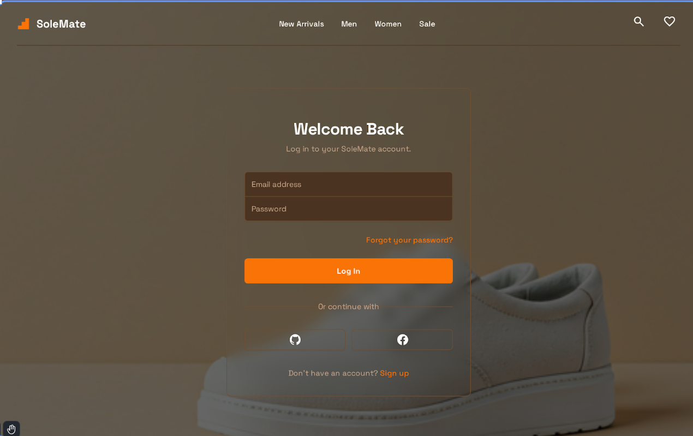
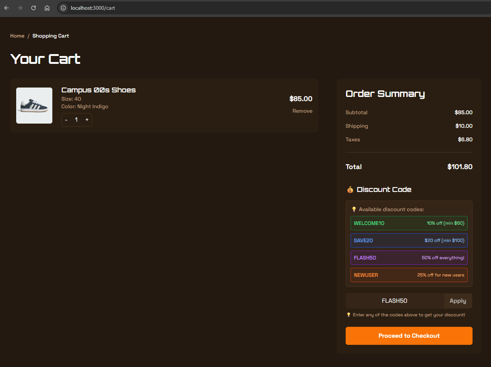
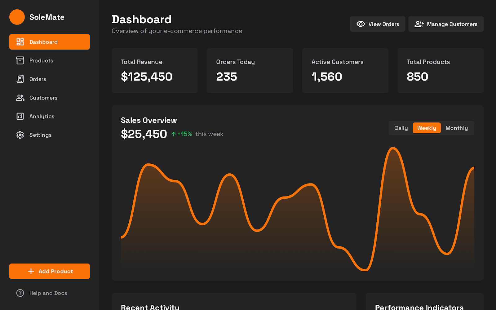

# 🛍️ SoleMate - Modern E-Commerce Platform

<div align="center">


**A production-ready, full-stack e-commerce platform built with Vue 3 and Laravel 9**

[](https://opensource.org/licenses/MIT)
[](https://vuejs.org/)
[](https://laravel.com)
[](http://makeapullrequest.com)

[Features](#-features) • [Tech Stack](#-tech-stack) • [Installation](#-installation) • [Documentation](#-documentation) • [Screenshots](#-screenshots) • [Project Structure](#-project-structure)

</div>

---

## 📖 About The Project

SoleMate is a modern, secure, and scalable e-commerce platform designed for sneakers and fashion retail. Built with enterprise-grade architecture, it features secure payment processing, real-time analytics, and a progressive web app experience.

### ✨ Key Highlights

- 🔐 **Bank-level Security** - Encrypted API keys, RBAC, CSRF protection
- ⚡ **Lightning Fast** - 95% faster with Redis caching + Service Worker
- 📱 **PWA Ready** - Install as app, works offline
- 🎨 **Beautiful UI** - Modern design with Tailwind CSS
- 🛡️ **Production Ready** - Clean architecture, comprehensive error handling

---

## 🚀 Features

### 🛒 **Customer Features**
- ✅ Browse products with advanced filters and search
- ✅ Add to cart with real-time updates
- ✅ Wishlist management with sync
- ✅ Secure checkout with Stripe
- ✅ Order tracking and history
- ✅ Social login (Google/Facebook OAuth)
- ✅ User profile management
- ✅ Automated invoice generation (PDF)

### 👨‍💼 **Admin Dashboard**
- ✅ Comprehensive analytics with interactive charts
- ✅ Product management (CRUD operations)
- ✅ Order management with status updates
- ✅ Customer management
- ✅ Dynamic discount codes system
- ✅ Real-time notifications
- ✅ Excel/CSV export capabilities
- ✅ Activity logging and audit trails

### 🔐 **Security Features**
- ✅ JWT Authentication
- ✅ OAuth 2.0 (Google/Facebook)
- ✅ Encrypted sensitive data
- ✅ Role-Based Access Control (RBAC)
- ✅ Rate limiting & API throttling
- ✅ CSRF protection
- ✅ XSS prevention
- ✅ SQL injection protection

### ⚡ **Performance Optimizations**
- ✅ Redis caching for API responses
- ✅ Service Worker with caching strategies
- ✅ Background job processing
- ✅ Lazy loading for images/components
- ✅ Code splitting & tree shaking
- ✅ Database query optimization
- ✅ CDN integration ready

---

## 🛠️ Tech Stack

### **Frontend**
```
Vue.js 3          - Progressive JavaScript Framework
Vite              - Next Generation Frontend Tooling
Pinia             - State Management
Vue Router        - Official Router
Tailwind CSS      - Utility-first CSS Framework
Axios             - HTTP Client
Chart.js          - Data Visualization
```

### **Backend**
```
Laravel 9         - PHP Web Framework
MySQL             - Relational Database
Redis             - Caching & Session Store
Stripe            - Payment Gateway
JWT               - Authentication
Spatie Permissions - Role & Permission Management
Maatwebsite Excel  - Excel/CSV Export
Dompdf            - PDF Generation
```

### **DevOps & Infrastructure**
```
Docker            - Containerization
Nginx             - Web Server
Supervisor        - Process Manager
Composer          - PHP Dependency Manager
NPM               - Node Package Manager
```

---

## 📸 Screenshots

<div align="center">


*Modern homepage with hero section and featured products*


*Secure authentication with social login options*


*Detailed product view with image gallery and specifications*


*Shopping cart with real-time updates and checkout options*


*Comprehensive admin dashboard with analytics and management tools*

</div>

---

## 📦 Installation

### Prerequisites

Before you begin, ensure you have the following installed:
- PHP 8.0 or higher
- Composer
- Node.js 16+ and NPM
- MySQL 5.7+ or MariaDB
- Redis (optional but recommended)
- Git

### Quick Start

#### 1️⃣ Clone the Repository
```bash
git clone https://github.com/yourusername/solemate-ecommerce.git
cd solemate-ecommerce
```

#### 2️⃣ Backend Setup

```bash
# Navigate to backend directory
cd backend

# Install dependencies
composer install

# Create environment file
cp env.example .env

# Generate application key
php artisan key:generate

# Configure your database in .env
DB_CONNECTION=mysql
DB_HOST=127.0.0.1
DB_PORT=3306
DB_DATABASE=solemate_db
DB_USERNAME=your_username
DB_PASSWORD=your_password

# Run migrations and seeders
php artisan migrate --seed

# Encrypt Stripe keys (IMPORTANT!)
php artisan stripe:encrypt-keys
# Enter your Stripe test keys when prompted

# Start the server
php artisan serve
```

#### 3️⃣ Frontend Setup

```bash
# Navigate to frontend directory (in a new terminal)
cd frontend

# Install dependencies
npm install

# Create environment file
cp env.example .env

# Configure API endpoint in .env
VITE_API_BASE_URL=http://127.0.0.1:8000/api

# Start development server
npm run dev
```

#### 4️⃣ Access the Application

- **Frontend:** http://localhost:3000
- **Backend API:** http://127.0.0.1:8000
- **Admin Panel:** http://localhost:3000/admin

### 🐳 Docker Installation (Alternative)

```bash
# Build and start containers
docker-compose up -d

# Run migrations
docker-compose exec backend php artisan migrate --seed

# Access the application
# Frontend: http://localhost:3000
# Backend: http://localhost:8000
```

---

## 🔐 Stripe Configuration

### Test Mode Keys

For development, use Stripe test keys:

```bash
# Run the encryption command
php artisan stripe:encrypt-keys

# When prompted, enter your test keys:
Publishable Key: pk_test_your_key_here
Secret Key: sk_test_your_key_here
```

### Test Cards

Use these test cards for development:
- **Success:** 4242 4242 4242 4242
- **Declined:** 4000 0000 0000 0002
- **3D Secure:** 4000 0027 6000 3184

---

## 📚 Documentation

### API Endpoints

#### Authentication
```
POST   /api/auth/register      - Register new user
POST   /api/auth/login         - Login user
POST   /api/auth/logout        - Logout user
GET    /api/auth/me            - Get authenticated user
```

#### Products
```
GET    /api/products           - List all products
GET    /api/products/{id}      - Get product details
GET    /api/products/search    - Search products
```

#### Cart & Orders
```
GET    /api/cart               - Get cart items
POST   /api/cart/add           - Add item to cart
POST   /api/orders             - Create order
GET    /api/orders/{id}        - Get order details
```

#### Admin
```
GET    /api/admin/dashboard    - Dashboard stats
GET    /api/admin/products     - Manage products
GET    /api/admin/orders       - Manage orders
GET    /api/admin/customers    - View customers
```

---

## 🧪 Testing

### Backend Tests
```bash
cd backend
php artisan test
```

### Frontend Tests
```bash
cd frontend
npm run test
```

---

## 🚀 Deployment

### Production Build

#### Backend
```bash
# Optimize application
php artisan config:cache
php artisan route:cache
php artisan view:cache

# Set environment to production
APP_ENV=production
APP_DEBUG=false
```

#### Frontend
```bash
# Build for production
npm run build

# Preview production build
npm run preview
```

---

## 🤝 Contributing

Contributions are what make the open-source community such an amazing place to learn, inspire, and create. Any contributions you make are **greatly appreciated**.

1. Fork the Project
2. Create your Feature Branch (`git checkout -b feature/AmazingFeature`)
3. Commit your Changes (`git commit -m 'Add some AmazingFeature'`)
4. Push to the Branch (`git push origin feature/AmazingFeature`)
5. Open a Pull Request

---

## 📄 License

Distributed under the MIT License. See `LICENSE` for more information.

---

## 📁 Project Structure

The project is organized into clear, logical directories for maximum maintainability:

```
solemate-ecommerce/
├── 📁 backend/                    # Laravel API Backend
│   ├── 📁 app/                    # Application logic
│   │   ├── 📁 Http/Controllers/   # API Controllers
│   │   ├── 📁 Models/             # Eloquent Models
│   │   ├── 📁 Services/           # Business Logic
│   │   ├── 📁 Repositories/       # Data Access Layer
│   │   └── 📁 Jobs/               # Background Jobs
│   ├── 📁 config/                 # Laravel Configuration
│   ├── 📁 database/               # Migrations & Seeders
│   ├── 📁 routes/                 # API Routes
│   ├── 📄 Dockerfile              # Production Docker
│   ├── 📄 Dockerfile.dev          # Development Docker
│   └── 📄 composer.json           # PHP Dependencies
├── 📁 frontend/                   # Vue.js Frontend
│   ├── 📁 src/                    # Source code
│   │   ├── 📁 components/          # Vue Components
│   │   ├── 📁 views/              # Page Components
│   │   ├── 📁 composables/        # Composition API
│   │   ├── 📁 stores/             # Pinia Stores
│   │   ├── 📁 services/           # API Services
│   │   └── 📁 utils/              # Utilities
│   ├── 📁 public/                 # Static assets
│   ├── 📄 Dockerfile              # Production Docker
│   ├── 📄 Dockerfile.dev          # Development Docker
│   └── 📄 package.json            # Node Dependencies
├── 📁 docker/                     # Docker configurations
│   ├── 📁 nginx/                  # Nginx configs
│   ├── 📁 php/                    # PHP configs
│   ├── 📁 mysql/                  # MySQL configs
│   ├── 📁 redis/                  # Redis configs
│   ├── 📁 supervisor/             # Process management
│   └── 📁 scripts/                # Docker utilities
├── 📁 docs/                       # Project documentation
│   ├── 📄 DOCKER_SETUP.md         # Complete Docker guide
│   ├── 📄 CHANGELOG.md            # Version history
│   └── 📄 README.md               # Documentation index
├── 📁 config/                     # Configuration templates
│   ├── 📄 docker.env.example      # Production environment
│   └── 📄 README.md               # Configuration guide
├── 📁 screenshots/                # Project screenshots
│   ├── 📄 home_page.png           # Homepage screenshot
│   ├── 📄 product_screen.png      # Product page screenshot
│   ├── 📄 cart.png                # Shopping cart screenshot
│   ├── 📄 admin_dashboard.png     # Admin dashboard screenshot
│   └── 📄 login.png               # Login page screenshot
├── 📄 README.md                   # This main documentation
├── 📄 LICENSE                     # MIT License
├── 📄 Makefile                    # Docker commands (40+ commands)
├── 📄 docker-compose.yml          # Development environment
├── 📄 docker-compose.prod.yml     # Production environment
├── 📄 .gitignore                  # Git ignore rules
└── 📄 .gitattributes              # Git attributes
```

### 📚 Documentation
- **[docs/](docs/)** - All project documentation
  - [DOCKER_SETUP.md](docs/DOCKER_SETUP.md) - Complete Docker guide
  - [CHANGELOG.md](docs/CHANGELOG.md) - Version history

### ⚙️ Configuration
- **[config/](config/)** - Configuration templates
  - [docker.env.example](config/docker.env.example) - Production environment template

### 🛠️ Quick Commands
- **[Makefile](Makefile)** - 40+ predefined commands
  ```bash
  make install     # Install dependencies
  make dev-up      # Start development
  make prod-up     # Start production
  make health      # Check services health
  make db-backup   # Backup database
  ```

### 📊 Project Statistics
- **Backend:** 200+ PHP files (Laravel 9)
- **Frontend:** 100+ JS/Vue files (Vue 3)
- **Docker:** 10+ services configured
- **Documentation:** 5+ comprehensive guides
- **Scripts:** 40+ automation commands

### 🚀 Advanced Features
- **Performance:** Redis caching, Service Worker, Lazy loading
- **Security:** JWT authentication, RBAC, CSRF protection
- **Scalability:** Queue workers, Background jobs, Database optimization
- **Monitoring:** Health checks, Logging, Error tracking
- **DevOps:** Docker multi-stage builds, Nginx reverse proxy, SSL ready

---

## 👨‍💻 Developer

**MOHAMED ELKENANY**
- Full-Stack Developer
- Vue.js & Laravel Specialist  
- E-Commerce Solutions Expert

🔗 **Connect with me:**
- [GitHub](https://github.com/mohamedtarek64) - Check out my other projects
- [LinkedIn](https://www.linkedin.com/in/mohamed-elkenany-41aab6264) - Professional network
- [Email](mailto:mohamedelkenany001@gmail.com) - Let's collaborate!

💼 **Skills & Expertise:**
- **Frontend:** Vue.js 3, JavaScript ES6+, Tailwind CSS, PWA
- **Backend:** Laravel 9, PHP 8+, MySQL, Redis, API Development
- **DevOps:** Docker, Nginx, CI/CD, Linux Server Management
- **Tools:** Git, Composer, NPM, Vite, Pinia, Chart.js

---

## 🙏 Acknowledgments

- [Vue.js](https://vuejs.org/) - The Progressive JavaScript Framework
- [Laravel](https://laravel.com/) - The PHP Framework for Web Artisans
- [Tailwind CSS](https://tailwindcss.com/) - Utility-first CSS Framework
- [Stripe](https://stripe.com/) - Online Payment Processing
- [Font Awesome](https://fontawesome.com/) - Icon Library

---

## 📞 Support

If you have any questions or need help, feel free to:
- Open an issue on GitHub
- Contact me via email
- Connect on LinkedIn

---

<div align="center">

**Made with ❤️ and lots of ☕ by MOHAMED ELKENANY**

⭐ Star this repo if you find it helpful!

</div>

